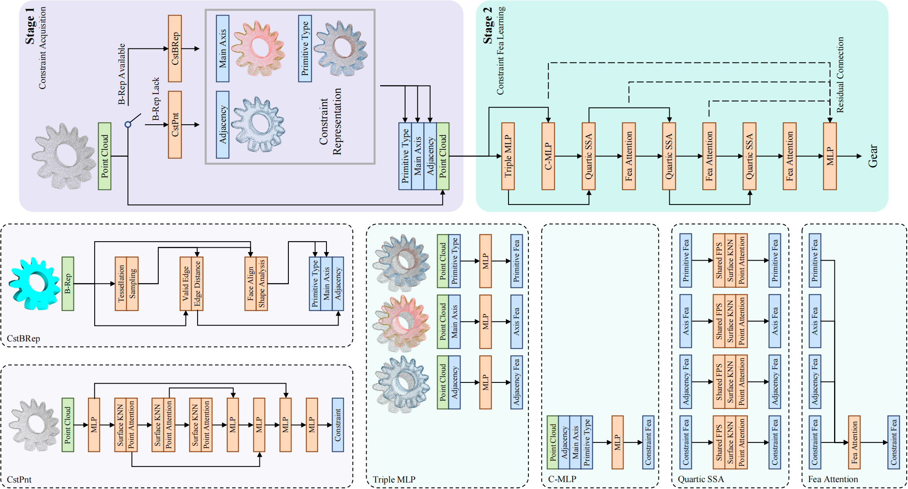

# Constraint-aware Feature Learning for Parametric Point Cloud
Main modules: pytorch, pyocc

## Model scripts
### train classification
`train_cls.py`

### train constraint prediction
`train_cstpnt.py`

### generate constraints from B-Rep data
`cst_brep.py`

## Structure
### overall

