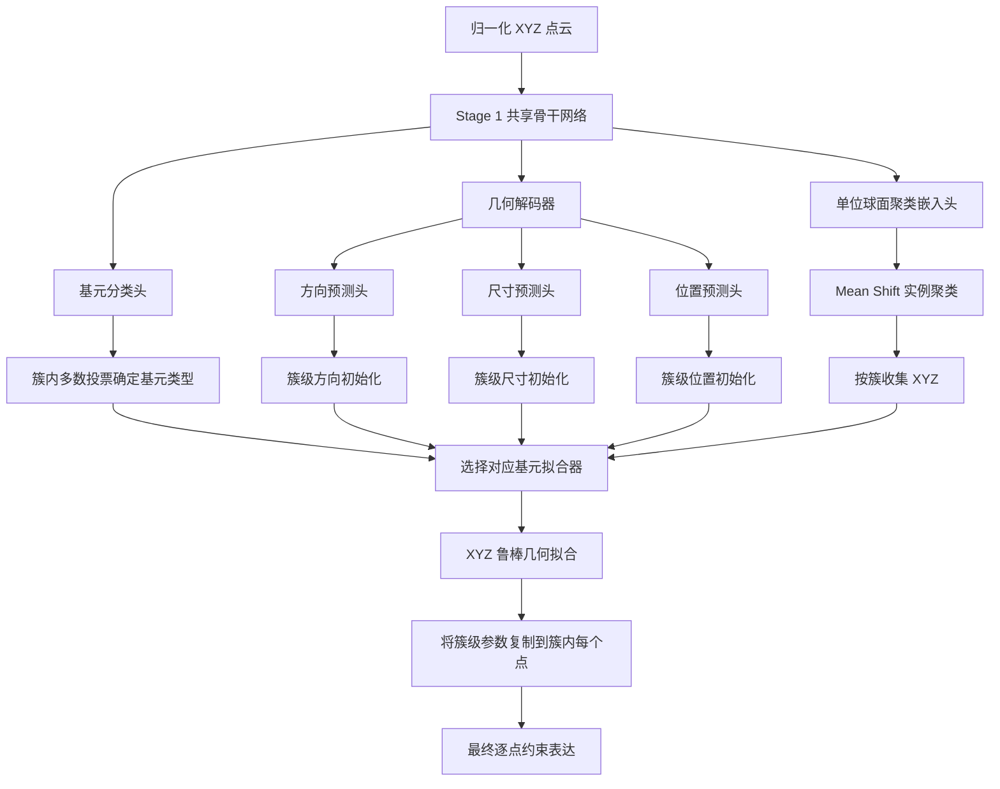

# CSTNet2 Stage 1 混合路线 C 技术说明

## 1. 文档目的

本文说明 CSTNet2 当前 Stage 1 的训练、聚类、几何拟合和评估流程，重点介绍正式推理方案：

> **路线 C：Mean Shift 聚类 + 预测头初始化 + XYZ 几何拟合**

路线 C 不是直接把几何预测头的逐点输出当作最终约束。预测头负责提供几何先验，拟合器再利用簇内点坐标求解最终基元参数。这样既保留神经网络对局部、不完整曲面的判断能力，又利用解析几何保证同一基元实例内的参数一致性。

Stage 1 训练完成后应冻结，作为 Stage 2 分类或分割任务的固定约束提取器。

---

## 2. 任务定义

### 2.1 输入

Stage 1 的输入为归一化点云：

```text
xyz: [B, N, 3]
```

其中坐标已经归一化到约 `[-1, 1]`。模型还可以根据 XYZ 构造曲率、密度等额外逐点特征。

### 2.2 最终输出

每个点的约束表达由四部分组成：

```text
constraint = {
    primitive_type,
    direction,
    dimension,
    location
}
```

各基元的定义如下：

| 基元类型 | `primitive_type` | `direction` | `dimension` | `location` |
| --- | --- | --- | --- | --- |
| 平面 | 5 类 one-hot | 平面法向 | `0`，无有效尺寸 | 原点到平面的垂足 |
| 圆柱 | 5 类 one-hot | 旋转轴方向 | 半径 | 原点到旋转轴的垂足 |
| 圆锥 | 5 类 one-hot | 旋转轴方向 | 半角，单位为弧度 | 圆锥顶点 |
| 球面 | 5 类 one-hot | `(0, 0, 0)`，无有效方向 | 半径 | 球心 |
| 自由曲面/其它 | 5 类 one-hot | `(0, 0, 0)` | `0` | `(0, 0, 0)` |

数据集中的旧无效值 `(0, 0, -1)` 和 `-1.0` 不需要重写。在数据加载时，代码会根据 GT 基元类型将无效方向和无效尺寸统一转换为零。

---

## 3. 总体流程



路线 C 中的两个关键边界是：

1. 神经网络输出的是逐点预测和聚类嵌入，不直接决定最终几何参数。
2. 最终约束参数由每个预测簇的 XYZ 拟合结果决定，预测头仅提供初始化候选。

---

## 4. 网络输出

`CstPredWrapper` 对每个点输出五个张量：

| 输出 | 形状 | 含义 |
| --- | --- | --- |
| `embedding` | `[B, N, D]` | L2 归一化的实例聚类特征，默认 `D=32` |
| `log_pmt` | `[B, N, 5]` | 五类基元的 log-softmax 概率 |
| `mad` | `[B, N, 3]` | L2 归一化的方向预测 |
| `dim` | `[B, N]` | 经 softplus 约束为非负的尺寸预测 |
| `loc` | `[B, N, 3]` | 位置预测 |

其中：

- `embedding` 和 `log_pmt` 决定预测实例及其基元类型。
- `mad`、`dim`、`loc` 为圆柱和圆锥拟合提供初始化，也作为几何监督头参与训练。
- 同一个预测簇最终只保留一组拟合参数，避免逐点输出在同一曲面内抖动。

---

## 5. 三阶段训练

Stage 1 按 Semantic、Geometry、Joint 三个阶段训练。每个阶段使用独立的检查点目录，并通过 `--checkpoint_policy auto` 自动续训或从上一阶段初始化。

### 5.1 Semantic 阶段

训练模块：

- 共享骨干网络；
- 聚类嵌入头；
- 基元分类头。

有效损失：

- 基元分类损失；
- 判别式实例聚类损失。

目标是先得到可靠的逐点基元类别和实例嵌入。几何预测头在此阶段未训练，因此每个 epoch 的完整路线评估不会使用它们初始化拟合器，只执行 Mean Shift 和 XYZ 拟合。

### 5.2 Geometry 阶段

训练模块：

- 几何解码器；
- 方向头；
- 尺寸头；
- 位置头。

Semantic 路径冻结，并保持冻结 BatchNorm 为评估模式。Geometry 阶段从 Semantic 检查点初始化，训练方向、尺寸、位置、几何残差和实例一致性损失。

### 5.3 Joint 阶段

训练模块：

- 聚类与分类头；
- 几何解码器和三个几何头；
- 骨干网络的高层模块。

Joint 阶段从 Geometry 的 `last.pth` 初始化。骨干高层默认使用较小学习率，预测头使用主学习率。此阶段同时微调语义、实例和几何表达，也是路线 C 最完整的训练状态。

### 5.4 推荐训练顺序

```powershell
python train_cst_pred.py --data_root <DATASET> --train_phase semantic
python train_cst_pred.py --data_root <DATASET> --train_phase geometry
python train_cst_pred.py --data_root <DATASET> --train_phase joint
```

默认检查点目录为：

```text
model_trained/stage1/<model>/semantic
model_trained/stage1/<model>/geometry
model_trained/stage1/<model>/joint
```

---

## 6. 训练损失

总损失为：

```text
L = wpmt·Lpmt
  + wcluster·Lcluster
  + wmad·Lmad
  + wdim·Ldim
  + wloc·Lloc
  + wgeom·Lgeom
  + winst·Linst
```

### 6.1 基元分类损失

`Lpmt` 使用五类负对数似然损失，监督逐点基元类型。

### 6.2 判别式聚类损失

`Lcluster` 使用 GT `affiliate_idx` 监督嵌入空间：

- 同一基元实例的点靠近实例中心；
- 不同实例的中心保持间隔；
- 对实例中心施加轻量正则。

训练时不需要在每个 batch 内对 Mean Shift 本身反向传播。Mean Shift 是推理和评估阶段的硬聚类步骤。

### 6.3 方向损失

平面法向、圆柱轴和圆锥轴都是无向轴，`v` 与 `-v` 表示相同几何方向。方向损失使用：

```text
Lmad = min(MSE(pred, gt), MSE(pred, -gt))
```

因此不会因 `dir_unify` 边界附近的符号翻转产生大误差。

### 6.4 尺寸与位置损失

尺寸和位置损失采用以下稳定化策略：

- 按基元实例先求平均，再在实例间平均，避免大曲面因点数多而主导训练；
- 使用 Smooth L1 限制大离群误差的梯度；
- 圆柱和球的半径在 `log1p` 空间比较；
- 根据“参数尺度/可见曲面范围”的比值降低弱可观测大半径、远轴线、远顶点和远球心的权重；
- 全局梯度范数默认裁剪到 `1.0`。

可观测性权重不会直接删除样本，最低保留 `0.05` 权重。

### 6.5 几何残差损失

`Lgeom` 直接检查预测参数和 XYZ 是否满足对应解析曲面：

- 平面：点到预测平面的距离；
- 圆柱：点到预测轴线的径向距离与半径之差；
- 圆锥：归一化径向分量与半角正弦的差；
- 球面：点到预测球心的距离与半径之差。

圆锥使用有界的归一化残差，避免远顶点或半角接近 `π/2` 时出现梯度爆炸。

### 6.6 实例一致性损失

`Linst` 约束同一 GT 实例内的基元概率、方向、尺寸和位置保持一致。方向在求簇均值前先进行符号对齐，避免正反方向互相抵消。

几何残差和实例一致性损失通过 `geom_start_epoch` 与 `geom_ramp_epochs` 逐步启用。

---

## 7. 路线 C 的实例聚类

### 7.1 Mean Shift 输入

Mean Shift 对每个点云独立运行，输入是已 L2 归一化的逐点 `embedding`。

### 7.2 自适应带宽

未显式设置 `mean_shift_bandwidth` 时，代码根据嵌入空间的近邻距离估计每个点云的带宽。默认参数为：

```text
mean_shift_quantile     = 0.015
mean_shift_iterations   = 20
mean_shift_max_clusters = 128
```

当模式数超过上限时，会逐步增大分位数并重新估计带宽；多次尝试后仍过多，才保留密度最高的模式。

### 7.3 模式更新与硬分配

所有点的嵌入都作为初始种子，通过高斯核迭代移动到局部模式。随后执行模式抑制，并按照与模式中心的余弦相似度，将每个点硬分配到一个预测簇。

Mean Shift 不使用 GT 实例数量，也不使用 GT 聚类中心。

### 7.4 簇级基元类型

每个预测簇的类型由簇内逐点 `log_pmt.argmax()` 结果多数投票得到。该类型决定后续调用平面、圆柱、圆锥、球面还是其它基元拟合器。

---

## 8. 预测头初始化

路线 C 首先把逐点几何预测聚合为簇级初始化：

### 8.1 方向初始化

由于方向存在正负等价性，不能直接对向量求均值。代码累加外积矩阵：

```text
S = Σ(vᵢ vᵢᵀ)
```

取 `S` 最大特征值对应的特征向量作为簇级方向，因此 `v` 与 `-v` 会产生相同贡献。

### 8.2 尺寸和位置初始化

- 尺寸：对簇内有限预测值取中位数；
- 位置：对簇内有限三维预测取逐坐标中位数。

### 8.3 初始化的作用边界

当前实现中，预测头初始化直接用于圆柱和圆锥。它只是候选初值之一，最终仍要和从 XYZ、局部法向得到的候选共同竞争，并由几何残差选择最优结果。

这一区别非常重要：

```text
路线 A：预测头输出就是最终结果
路线 C：预测头输出只是拟合起点，XYZ 拟合结果才是最终结果
```

---

## 9. 分基元几何拟合

### 9.1 局部法向

默认使用簇内 XYZ 的 KNN-PCA 估计局部法向，`normal_k=16`。法向仅是拟合过程的中间量，不会加入最终约束表达。

### 9.2 平面

平面拟合使用点坐标 PCA 的最小特征向量作为候选法向，并可与局部法向均值融合。拟合后计算原点到平面的垂足：

```text
location = normal · dot(normal, cluster_center)
```

平面的 `dimension` 固定为零。

### 9.3 圆柱

圆柱拟合在 float64 中构造多组候选：

- 预测头给出的轴、半径和轴线位置；
- 局部法向协方差得到的轴；
- 点坐标 PCA 得到的轴；
- 法向交会、二维圆拟合和点云中心投影得到的轴线位置。

每组候选都经过非线性迭代细化，并使用裁剪后的几何残差评分选择最优解。最终输出：

```text
direction = 圆柱轴方向
dimension = 半径
location  = 原点到轴线的垂足
```

### 9.4 圆锥

圆锥同样在 float64 中使用多候选策略：

- 预测头给出的轴、半角和顶点；
- 局部法向得到的轴；
- 点坐标 PCA 得到的轴；
- 轴向—径向剖面拟合得到的顶点和半角；
- 退化情况下的有限回退候选。

候选经过带步长限制和回溯接受策略的迭代细化，再按裁剪几何残差选择最优结果。最终输出轴方向、半角和顶点。

### 9.5 球面

点数足够时使用线性最小二乘求球心和半径；求解失败或点数不足时退化为点均值和平均距离。

### 9.6 自由曲面/其它

不进行解析基元拟合，方向、尺寸和位置均输出零。

### 9.7 回填逐点约束

一个簇只拟合一次。拟合得到的基元类型、方向、尺寸和位置被复制到该簇内所有点，从而保证实例内部约束完全一致。

---

## 10. 方向统一与指标计算

拟合器会对有效方向进行规范化和半空间统一，但训练损失与评估指标都不依赖这个离散符号规则来判断等价性。

方向角误差为：

```text
angle = acos(abs(dot(normalize(pred), normalize(gt))))
```

因此共线但相反的两个方向误差为零。

属性指标的有效 GT 类型为：

| 指标 | 参与统计的 GT 基元 |
| --- | --- |
| 方向角误差 | 平面、圆柱、圆锥 |
| 尺寸绝对误差 | 圆柱、圆锥、球面 |
| 位置距离误差 | 平面、圆柱、圆锥、球面 |

无效方向和尺寸不会参与对应指标。

---

## 11. 训练期间的完整路线评估

每个 epoch 完成参数更新后，训练器会：

1. 将模型切换到评估模式；
2. 使用该 epoch 的最终参数重新遍历训练集；
3. 对每个点云执行 Mean Shift；
4. 聚合预测头初始化；
5. 对每个预测簇执行 XYZ 拟合；
6. 汇总完整数据集上的三个拟合属性指标；
7. 将指标写入训练 JSON 和 W&B；
8. 恢复对应训练阶段的模型模式。

W&B 中的完整路线指标为：

```text
metric/fitted/direction_mean_angular_error_deg
metric/fitted/dimension_mean_absolute_error
metric/fitted/location_mean_distance_error
```

预测头直接输出的指标仍保留为：

```text
metric/direction_mean_angular_error_deg
metric/dimension_mean_absolute_error
metric/location_mean_distance_error
```

两组曲线分别回答：

- 直接指标：三个预测头本身是否在收敛；
- `fitted` 指标：最终交给 Stage 2 的路线 C 输出是否在改善。

完整路线评估不计算梯度，不影响优化器状态，也不参与当前最佳检查点的选择。最佳检查点仍由基元 mIoU、真实聚类 ARI 及其组合分数决定。

---

## 12. 离线评估与生成

### 12.1 完整评估

```powershell
python eval_cst_pred.py `
  --data_root <EVAL_DATASET> `
  --checkpoint model_trained/stage1/<model>/joint/best_constraint_score.pth
```

评估器同时输出预测头直接指标和拟合路线指标。

### 12.2 生成供 Stage 2 使用的约束数据

```powershell
python gen_cst_pred.py `
  --input_dir <RAW_POINT_CLOUDS> `
  --output_dir <STAGE2_INPUT> `
  --checkpoint model_trained/stage1/<model>/joint/best_constraint_score.pth
```

输出核心字段顺序为：

```text
xyz, pmt, direction, dimension, location, affiliate_idx
```

Stage 2 使用冻结的 Stage 1 输出，不应反向更新 Stage 1。

---

## 13. 关键配置

| 参数 | 默认值 | 作用 |
| --- | ---: | --- |
| `cluster_method` | `meanshift` | 最终实例聚类方法 |
| `mean_shift_quantile` | `0.015` | 自适应带宽的近邻分位数 |
| `mean_shift_iterations` | `20` | Mean Shift 最大迭代次数 |
| `mean_shift_max_clusters` | `128` | 单个点云的最大模式数 |
| `mean_shift_bandwidth` | `None` | 固定带宽；为空时按点云估计 |
| `normal_k` | `16` | 局部 PCA 法向的邻域大小 |
| `grad_clip` | `1.0` | 全局梯度范数上限 |
| `joint_backbone_lr_scale` | `0.1` | Joint 阶段骨干高层学习率比例 |

可用的拟合消融参数：

```text
--disable_prediction_initialization
--disable_pca_normals_for_fitting
```

- 禁用预测头初始化后，对应路线 B：Mean Shift + XYZ 拟合。
- 两项均保持默认时，对应路线 C。

---

## 14. 当前限制与诊断建议

### 14.1 小簇与退化簇

当前 `assemble_constraints_from_stage1` 会拟合 Mean Shift 产生的每个非空簇，尚未设置统一的最小簇点数阈值，也没有在属性指标中自动排除小簇点。因此以下情况仍可能形成长尾误差：

- 小圆柱或小圆锥只保留少量采样点；
- 聚类把一个曲面切成多个碎片；
- 一个簇只覆盖圆柱或圆锥上的很窄区域；
- 大半径曲面在局部近似平面；
- 圆锥顶点远离可见点，问题本身弱可观测。

如需跳过小簇，应同时定义：

1. 每种基元的最小点数；
2. 被跳过点的无效掩码；
3. 训练指标、离线评估和 Stage 2 输入对掩码的统一处理。

只在某一处跳过会造成训练指标与真实推理结果不一致。

### 14.2 聚类误差与拟合误差要分开判断

最终属性误差可能来自三类上游问题：

```text
基元分类错误 → 选择了错误拟合器
实例聚类错误 → 簇内混入其它曲面或被过度切碎
几何退化     → 即使 GT 簇正确，参数仍不可稳定辨识
```

因此应结合以下曲线判断：

- `pmt_miou`：基元类型是否可靠；
- `cluster_ari_real` / `cluster_nmi_real`：预测实例是否可靠；
- 直接几何头指标：网络是否学到几何先验；
- `metric/fitted/*`：完整路线的最终表现。

如果直接头指标下降而 `fitted` 指标不下降，应优先检查聚类或拟合退化；如果两组指标都不下降，应优先检查几何监督、损失权重和训练阶段加载是否正确。

### 14.3 运行代价

每个 epoch 结束后的完整路线评估会额外执行一次完整数据前向、Mean Shift 和逐簇拟合。Mean Shift 的距离计算和局部法向估计都具有较高计算开销，因此训练墙钟时间会明显增加，但不会增加反向传播显存。

---

## 15. 代码索引

| 功能 | 文件 |
| --- | --- |
| Stage 1 训练入口 | `train_cst_pred.py` |
| 三阶段训练器与每 epoch 完整路线指标 | `functional/cst_pred_trainer.py` |
| 网络包装器和五个逐点输出 | `networks/cst_pred_wrapper.py` |
| 损失、方向等价与可观测性权重 | `functional/loss.py` |
| Mean Shift、几何拟合和约束组装 | `functional/constraints.py` |
| 属性、分类和聚类指标 | `functional/stage1_metrics.py` |
| 数据加载与旧无效值兼容 | `data_utils/stage1_dataset.py` |
| 独立评估 | `eval_cst_pred.py`、`functional/cst_pred_evaluator.py` |
| 离线生成 Stage 2 约束 | `gen_cst_pred.py` |

---

## 16. 总结

路线 C 的最终数据流可以概括为：

```text
XYZ
→ 逐点基元分类 + 聚类嵌入 + 几何预测头
→ Mean Shift 得到基元实例
→ 簇内多数投票确定基元类型
→ 聚合预测头得到几何初始化
→ 使用簇内 XYZ 和 PCA 法向进行鲁棒拟合
→ 将簇级拟合参数回填为逐点约束
→ 冻结后提供给 Stage 2
```

它以路线 A 的学习能力为先验，以路线 B 的解析几何一致性为最终约束，适合作为当前 Stage 1 的正式推理方案。路线 A 和路线 B 可以保留为消融基线，用于区分“预测头误差”“聚类误差”和“几何拟合误差”。
